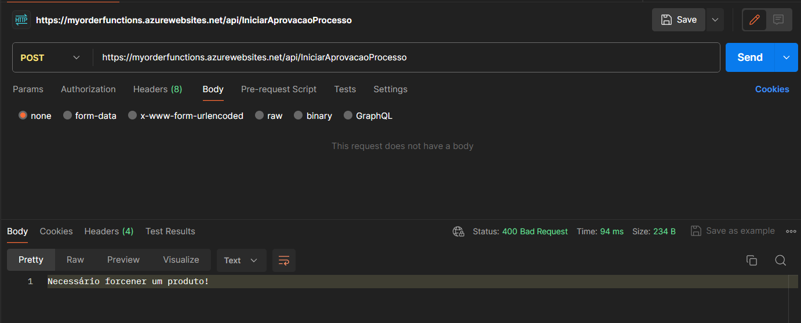
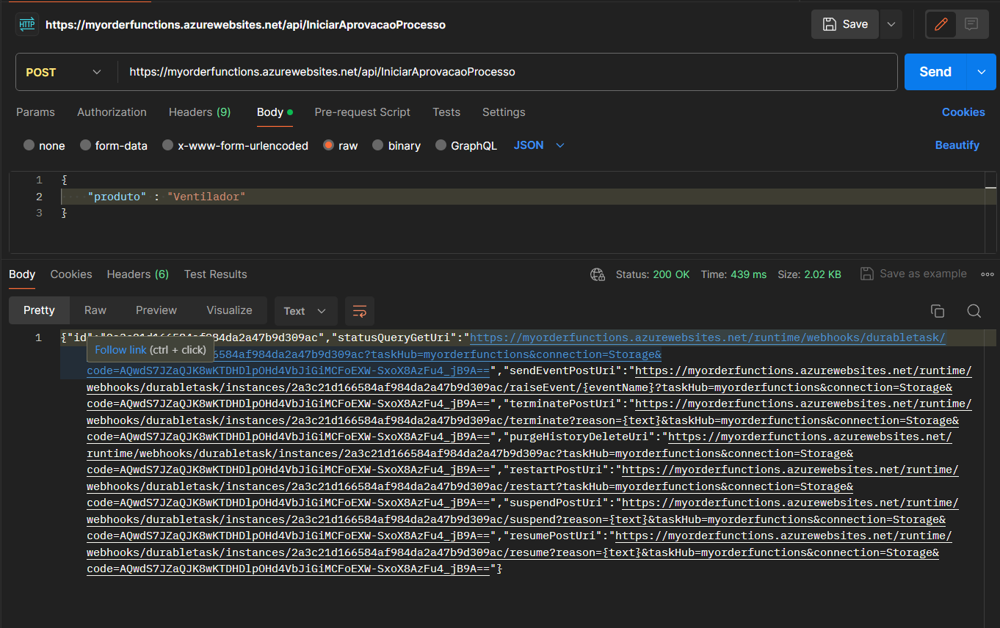
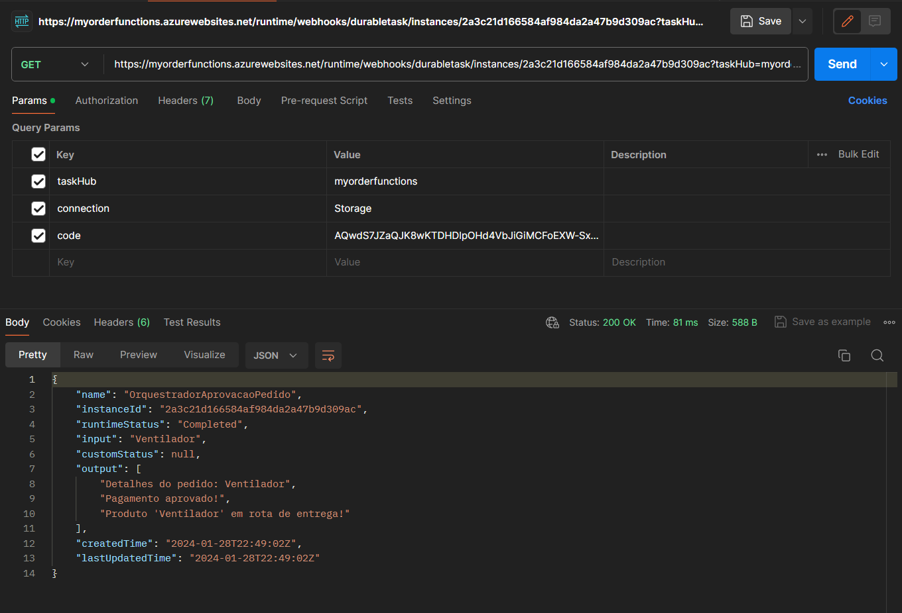

# Azure Durable Functions

## Projeto
A aplicação é um exemplo simples de uso do recurso Azure Durable Functions, uma extensão do Azure Functions!

O projeto demonstra o uso do template Durable utilizando o padrão Function Chaining ou Encadeamento de Funções, onde simula o processo de aprovação de um pedido
através de uma HTTP Trigger e salva os logs em uma Conta de Armazenamento posteriormente.

Para processar o pedido, o template utiliza o encadeamento de três funções:
* BuscarDetalhesPedido
* ProcessarPagamento
* EntregarProduto

No fim, exibe uma lista com a mensagem retornada por cada função.

# Como executar
Sugerimos utilizar o <a href="https://www.postman.com/">Postman</a> para fazer as requisições.

 

1. Faça uma requisição do tipo POST utilizando o endpoint da inicialização do orquestrador:
https://orderfunction.azurewebsites.net/api/IniciarAprovacaoProcesso

Quando a requisição é feita sem passar um produto através do body, retorna a mensagem 'Necessário fornecer um produto!'

3. Forneça um produto no body:

4. Abra o primeiro link retornado e faça uma requisição do tipo GET:  
   Poderá observar o retorno das mensagens de cada função.

